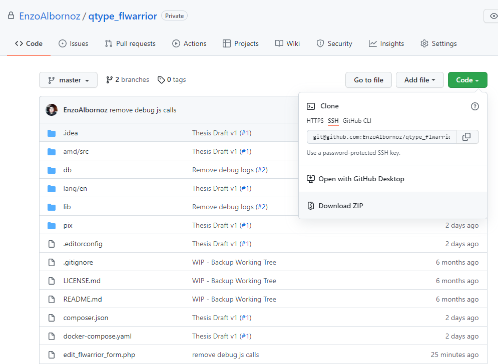
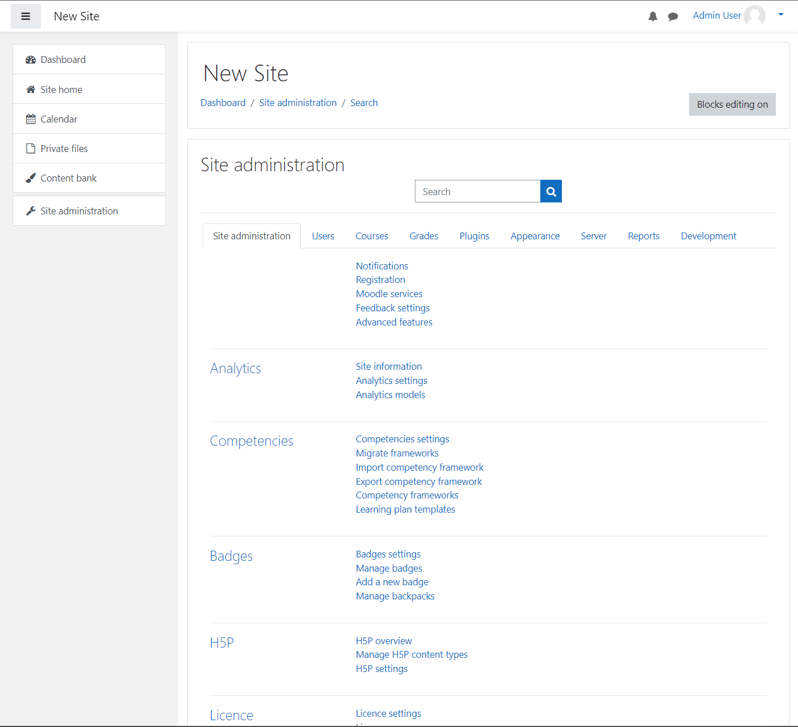
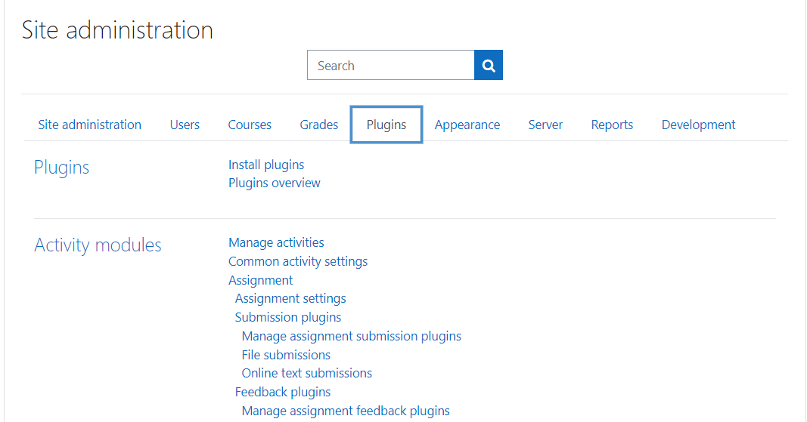
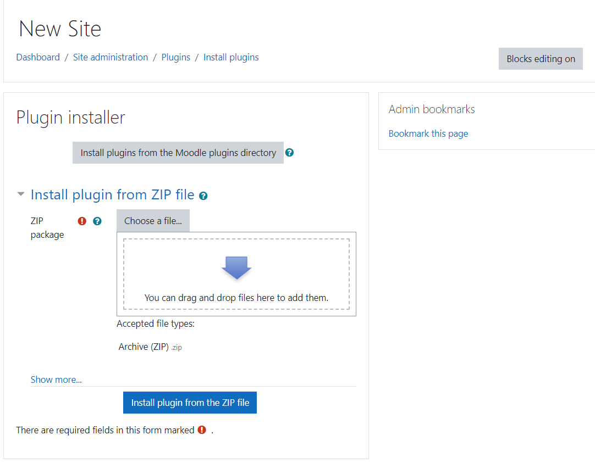

# Instalação do Plugin FLWarrior

## 1 - Download do Plugin

Para efetuar o download do plugin, proceda ao repositório do projeto em https://github.com/EnzoAlbornoz/qtype_flwarrior

Após isto, selecione a opção "Code" e em seguida "Download Zip", como visto na figura abaixo.

    

## 2 - Instalação via gerenciador de plugins

Para efetuar a instalação deste plugin o administrador do sistema deve acessar seção de "Administração do Site". A versão do Moodle necessária para o prosseguimento desta operação é a 3.11 .

    

Após isso, selecione a aba "Plugins".

    

Avançe para "Install plugins" (ou sua versão localizada, em caso da instância estiver sob alguma outra linguagem). Uma nova tela para a submissão de arquivos aparecerá.

    

Com isso basta anexar o arquivo, que fora feito o download previamente, na seção "Install plugin from ZIP file".

Após isso basta acionar o botão "Install plugin from the Zip file". Caso ocorra algum erro, verifique as permissões do usuário. Em caso de sucesso, um pequeno relátorio de alterações aparecerá.

Com isso, o plugin FLWarrior foi instalado ao Moodle.
