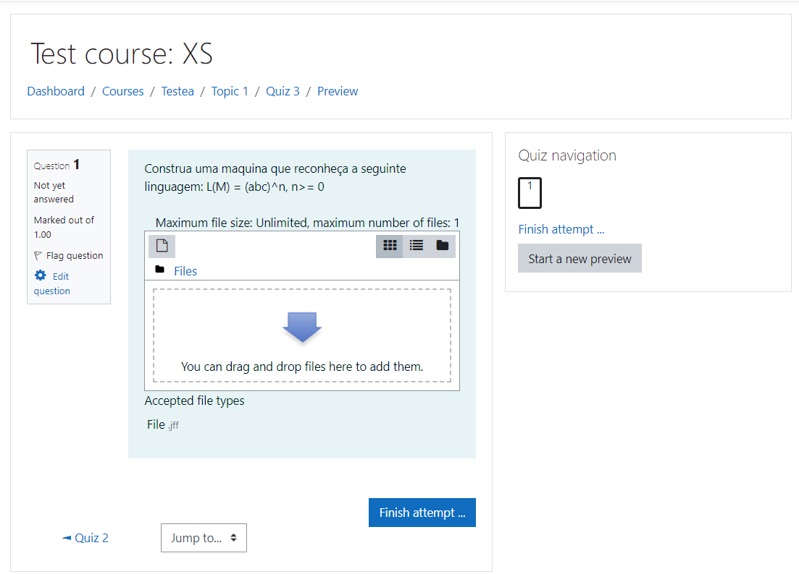
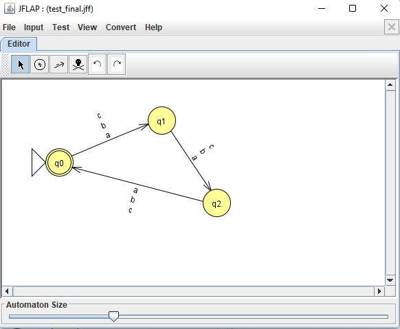
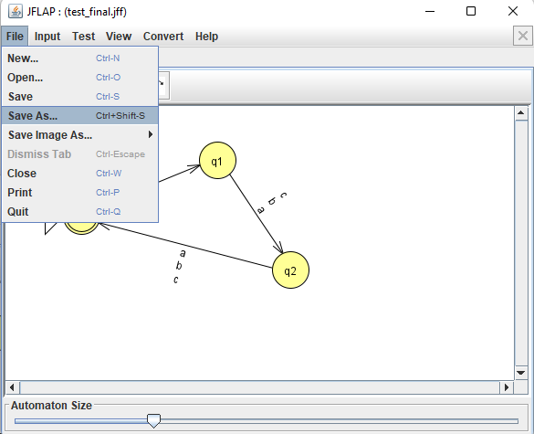
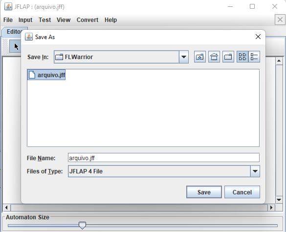
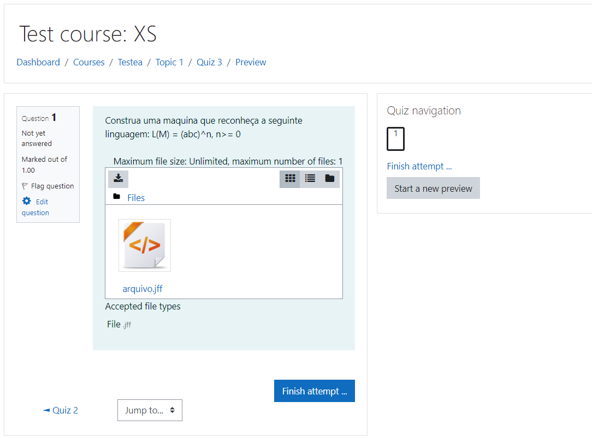
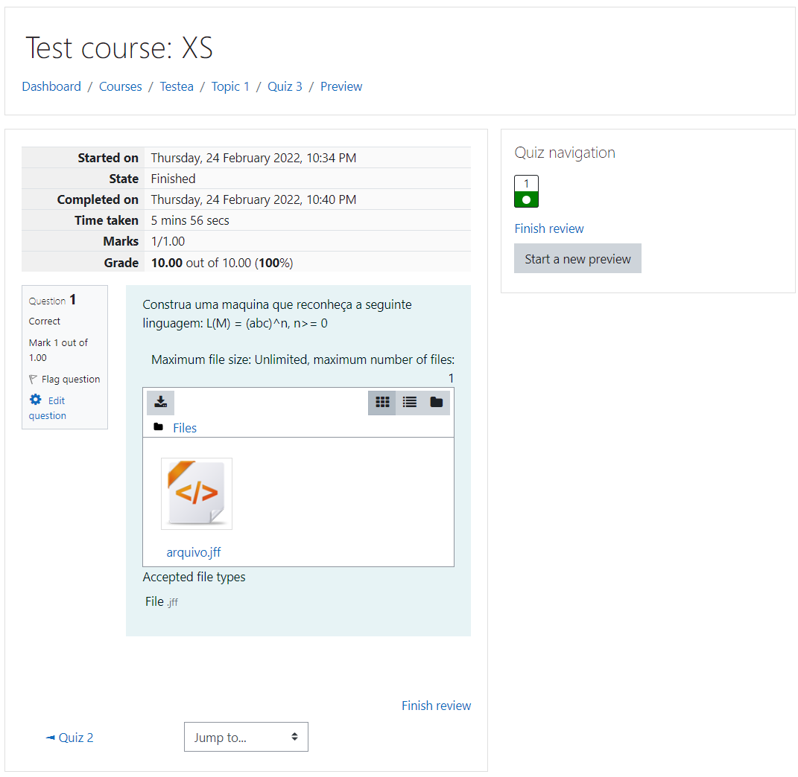

# Respondendo Questões do Plugin FLWarrior

## Etapa 1 - Iniciar Questão

Como aluno, acesse o quiz o qual deseja responder. Após isso, vá até a questão correspondente. A seguinte tela se apresentará.

    

## Etapa 2 - Responder a Questão

O aluno pode decidir construir o arquivo manualmente ou utilizar alguns construtor compatível com o formato JFLAP 4. Neste caso utilizou-se a ferramenta JFLAP.

    

Para exportar a máquina, vá em *File > Save As*

    

Após isso, selecione o local de exportação

    

## Etapa 3 - Submeter a Questão

De volta a questão, clique em anexar e selecione o arquivo ou arraste-o para dentro da caixa indicada. O arquivo deverá aparecer onde estava a caixa.

    

Basta agora continuar o quiz, respondendo outras questões e ao final, submeta todas as respostas.

## Etapa 4 - Revisão

Uma tela contendo a nota e a revisão, se configurado pelo professor no quiz, deverá aparecer.

    

