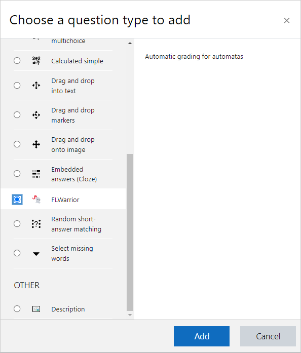
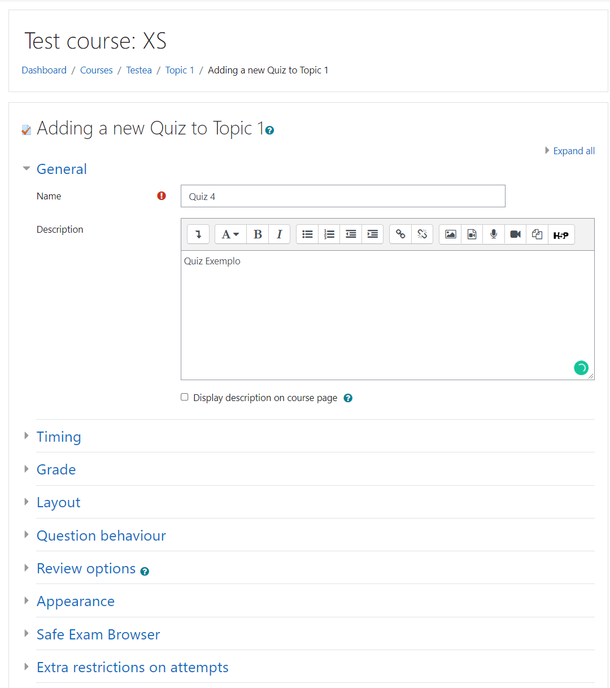
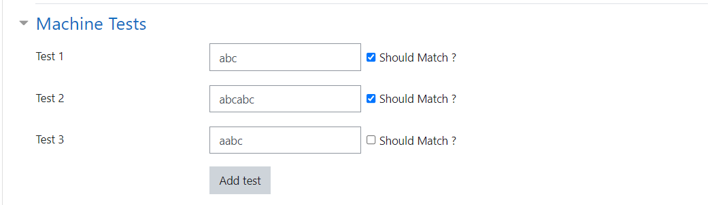

# Criando Questões do Plugin FLWarrior

Para isso o professor deverá ter permissão de edição do curso. O professor deverá criar uma nova atividade do tipo **Quiz**.

    

Preeencha normalmente a estrutura do quiz. Configurando

    

Ao criar uma nova questão, defina o tipo de questão como sendo do tipo FLWarrior.

    

No segmento de Machine Tests, defina os casos de teste para a linguagem requerida na questão, definindo a sentença a ser verificada e se ela deve ser aceita ou não pela máquina. Vale ressaltar que existe um limite máximo de iterações que a máquina pode fazer.

    

Após isso, basta publicar o quiz como qualquer outro dentro do Moodle.
